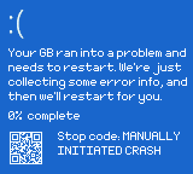
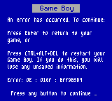
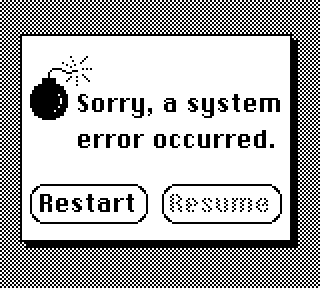
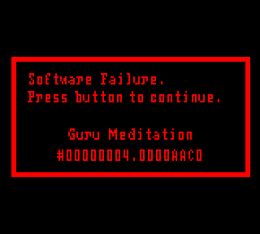
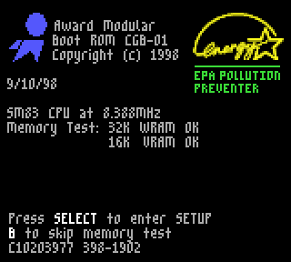

A little joke Blue Screen of Death simulator (BSOD) for the Game Boy with various versions of the screen and different operating systems.

Press `Left / Right / A / B` to cycle through the screens. A random one will be chosen on startup.

Currently only for Game Boy Color, it will show a game boy style crash screen on non-color models when starting up.

BSOD's for
- Windows 10/11
- Windows 8
- Windows 9x
- Windows Longhorn
- Mac OS classic
- Max OS X
- Amiga
- GBStudio

The Game Boy can be "rebooted" at any time to show a BIOS style boot screen by pressing `SELECT + START + A + B` all together.

This uses "hi-color" rendering on the gbc which is fairly over-powered for the purpose and amount of colors on most of the screens. But it was less effort repurposing the existing example project for that than starting from scratch.

Requires GBDK 4.2.0 or higher.
